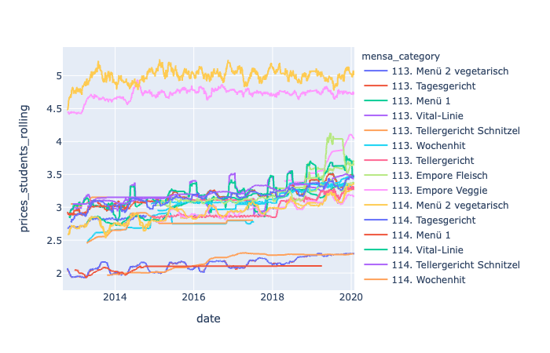

# Mensalysis

... was a Friday evening project with [@geistesk](https://github.com/geistesk) to investigate the variety, pricing and ingredients of german mensa food.

## Data source

While the menues of almost any mensa is available online, only few provide archives on their food. Luckily there is [OpenMensa](https://openmensa.org), who do not only offer a great common interface, but serve historical data through [their API](https://doc.openmensa.org/api/v2/), for which a [simple downloader (openmensa.py)](openmensa.py) was written fast.

## Data analysis

I like the python data science stack consisting of [pandas](https://pandas.pydata.org), [seaborn](https://pandas.pydata.org) and [plotly](https://plot.ly/python/plotly-express/) very much, and it becomes very accessible through [jupyter notebooks](https://jupyter.org).

A first analysis of Studentenwerk Marburg is available in the respective notebook [marburg.ipynb](https://nbviewer.jupyter.org/github/jonashoechst/mensalysis/blob/master/marburg.ipynb).

## Caveats

* meal names are not consistent
* allergens are not consistent

## Upcoming ideas

* Cluster meal names
* regex for keywords in meal names, e.g. 'schwein', 'pute' or 'vegan', to obtain further information 

## Feedback

Any further ideas? I'm happy to receive ideas via pull requests or issues.
